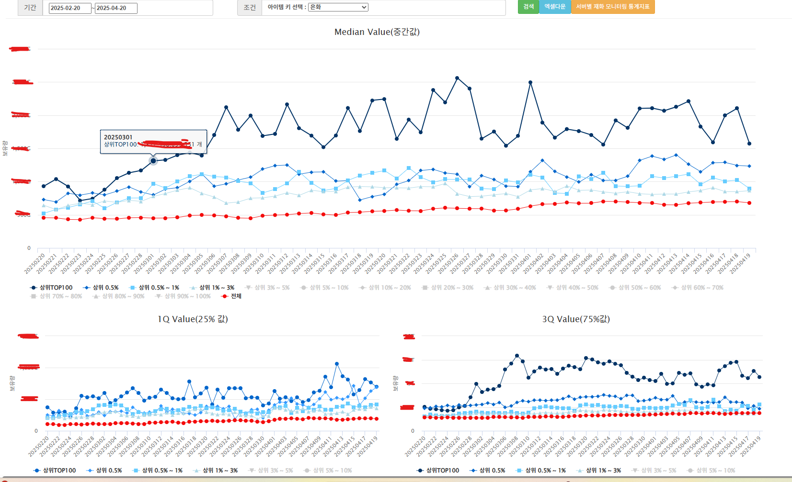

# 🔄 은화 및 재화 모니터

유저 수준에따라 재화를 보유하고 수집하는 수준을 보여주는 자료입니다.
아래 대시보드 외에도 여러가지 통계지표를 시각화와 테이블로 보여주는 대시보드 입니다.

---

## 📊 분석 차트

위 그래프는 다음을 보여줍니다:

- X축: 날짜 (예: 2025-03-01 ~ 2025-03-31)
- Y축: 보유 수/획득소비수
- 색상: 공방합 세그먼트 (0, 100, 200, ..., 전체)

---

## 📌 인사이트 요약

- 공방합 400~700 구간에서 유저 이탈이 급격히 증가
- 100~300 구간은 안정적인 유지율
- 일부 세그먼트는 특정 날짜에 이탈 급증 (이벤트 영향 추정)
